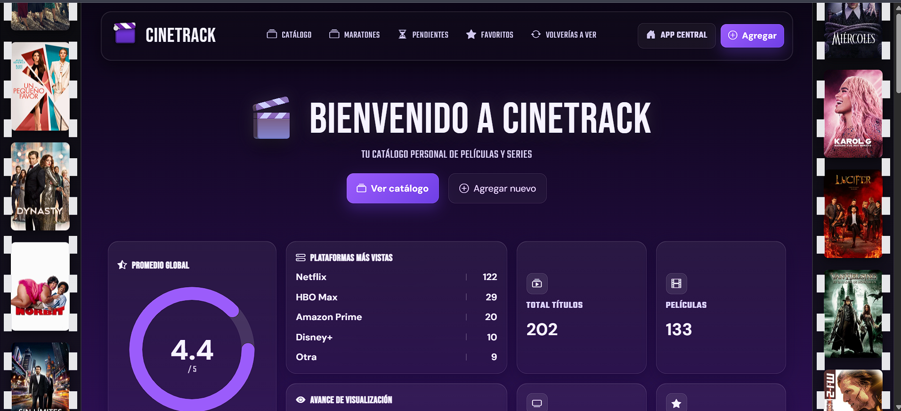
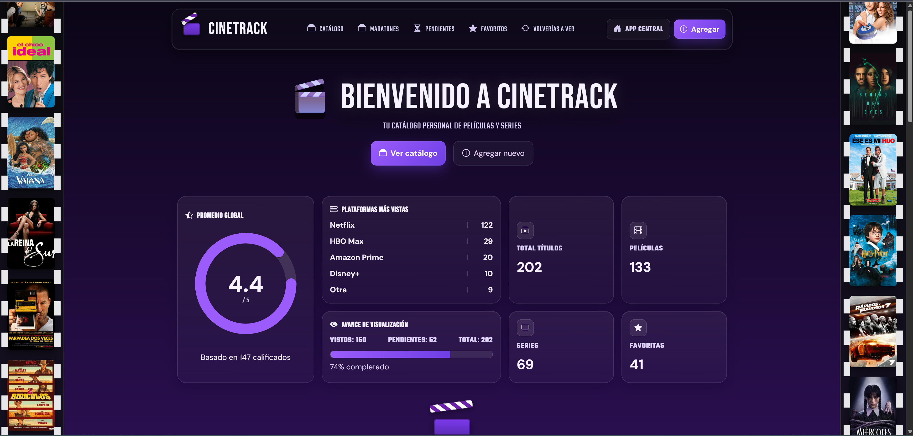
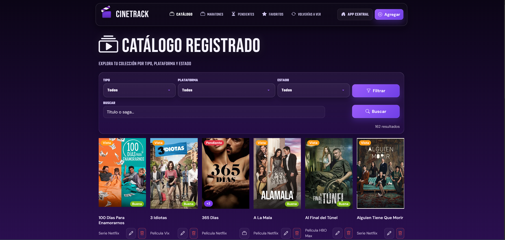
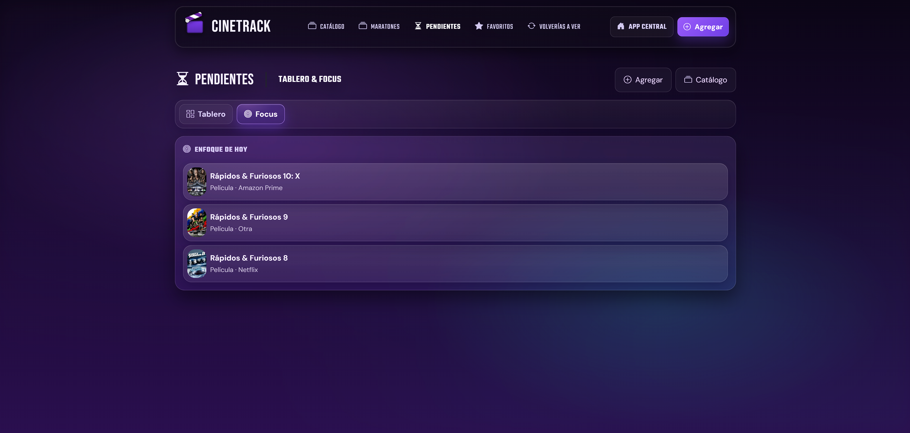
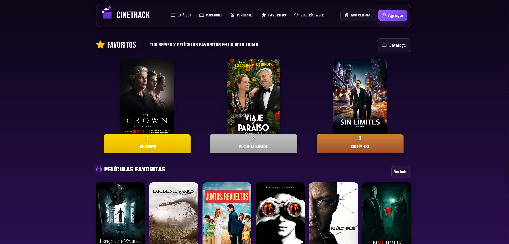
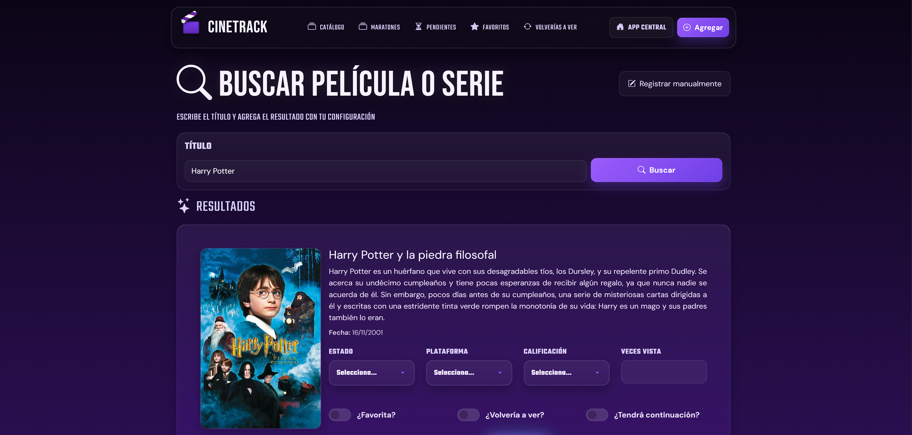
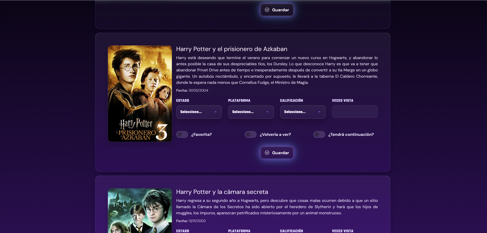

# CineTrack

Plataforma web para la gestión y seguimiento de películas y series. Permite organizar contenido por estado, plataforma, favoritos y progreso de visualización.

---

## Vista general

CineTrack funciona como un catálogo personal donde puedes registrar películas y series, clasificarlas, calificarlas y visualizar estadísticas de consumo.

---

## Funcionalidades principales

- Registro manual y búsqueda de películas/series (integración con API externa)
- Catálogo filtrable por tipo, plataforma y estado
- Sistema de pendientes con tablero tipo Kanban
- Gestión de favoritos
- Métricas y estadísticas (promedio, progreso, conteos)
- Clasificación personalizada y seguimiento de visualización

---

## Capturas

### Dashboard

---

### Catálogo

---

### Pendientes

---

### Favoritos

---

### Búsqueda

---

## Tecnologías

- Python
- Django
- SQLite
- HTML / CSS / Bootstrap
- JavaScript

---

## Estructura del proyecto

- `cinetrack/` → lógica principal (modelos, vistas, urls)
- `templates/` → interfaz de usuario
- `static/` → estilos y assets
- `utils.py` → integración con API externa

---

## Notas

Este proyecto forma parte de AppCentral, una suite de aplicaciones enfocadas en productividad y gestión personal.
