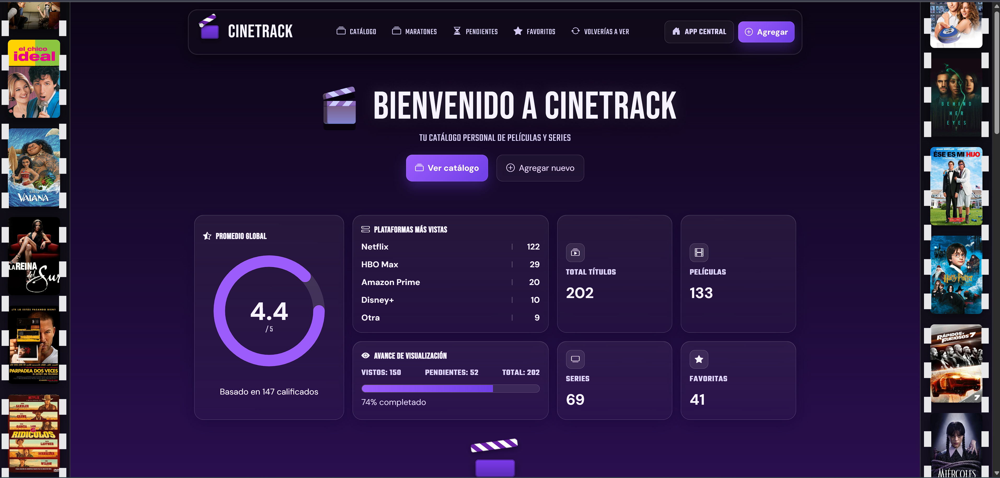
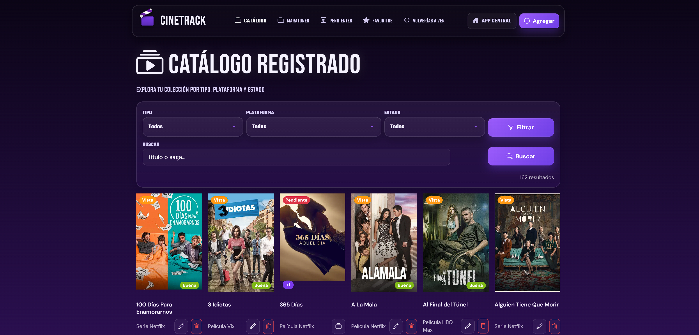
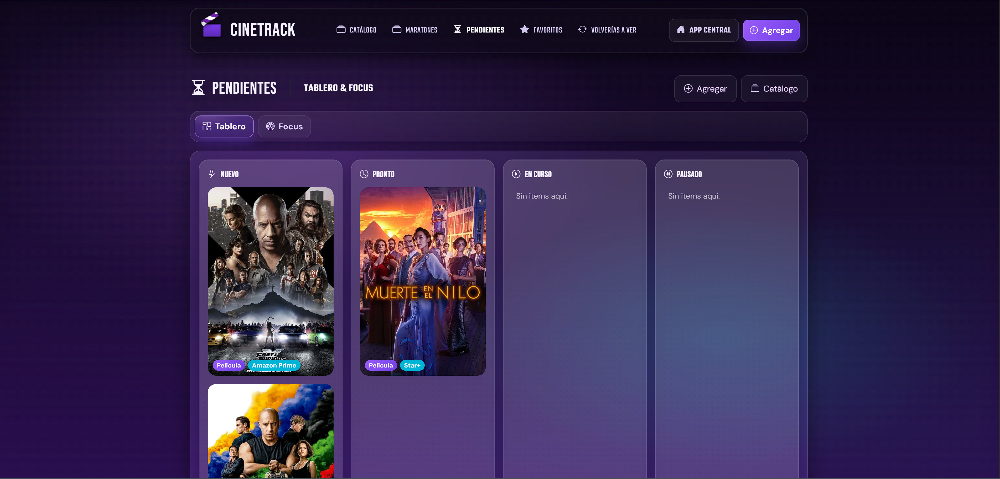
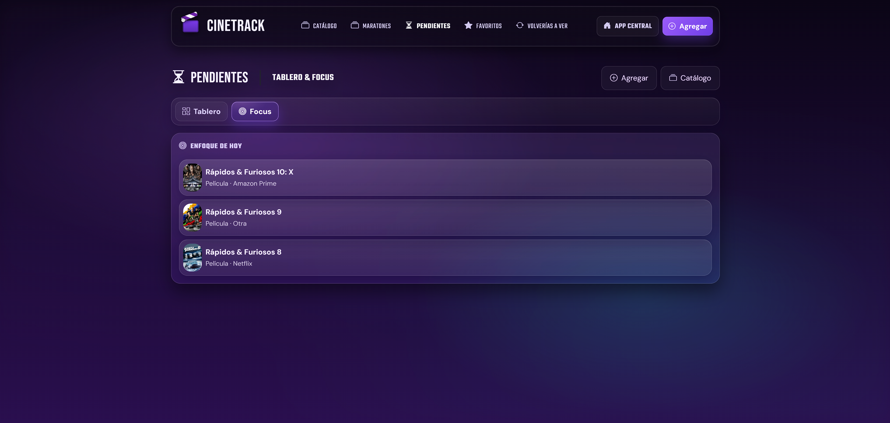
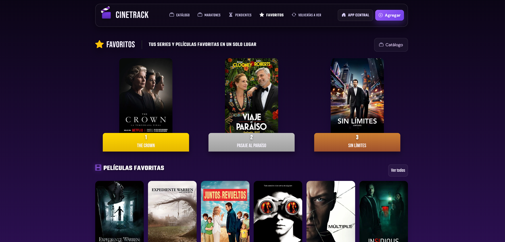
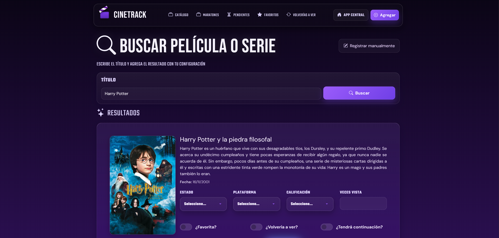
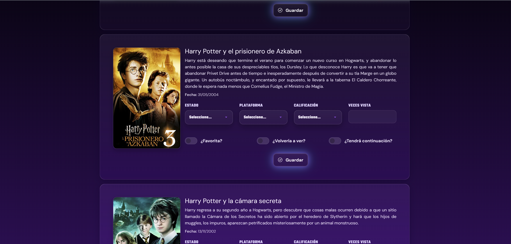

# CineTrack


****

[](https://cinetrack-1wf6.onrender.com)

CineTrack is a Django web application that allows users to organize and manage their personal movie and TV series collection. It integrates with The Movie Database (TMDB) API to simplify content registration and includes features such as favorites, viewing status tracking, ratings, franchises, and personal watchlists.

## Features

- Personal movie and TV series catalog.
- TMDB API integration.
- Automatic content registration from TMDB.
- Manual content registration.
- Edit and delete registered content.
- Favorites management.
- Viewing status tracking.
- Five-star rating system.
- View counter.
- Franchise organization.
- Responsive interface.
- REST API built with Django REST Framework.

## Technologies

- Python 3.12
- Django 5
- Django REST Framework
- PostgreSQL
- HTML5
- CSS3
- JavaScript
- Bootstrap
- TMDB API
- Gunicorn
- WhiteNoise

## Project Structure

```text
CineTrack/
├── cinetrack/
├── config/
├── docs/
├── manage.py
├── requirements.txt
├── .env.example
└── README.md
```

## Installation

Clone the repository:

```bash
git clone https://github.com/aikomarin/cinetrack.git
cd cinetrack
```

Create and activate a virtual environment.

**Windows**

```bash
python -m venv .venv
.venv\Scripts\activate
```

Install the dependencies.

```bash
pip install -r requirements.txt
```

Create a `.env` file using `.env.example` as a reference.

Apply migrations.

```bash
python manage.py migrate
```

Run the development server.

```bash
python manage.py runserver
```

## Environment Variables

The project requires the following environment variables:

```env
SECRET_KEY=
TMDB_API_KEY=

DB_NAME=
DB_USER=
DB_PASSWORD=
DB_HOST=
DB_PORT=

DEBUG=
ALLOWED_HOSTS=
```

## REST API

CineTrack exposes a REST API built with Django REST Framework.

Main endpoint:


```text
/api/cinetrack/contenidos/
```

## Screenshots

Below are some screenshots of the application.

### Home Dashboard



### Catalog



### Pending Board



### Focus Mode



### Favorites



### TMDB Search



### Search Results




## Learning Objectives

This project was built to practice and improve skills in:

- Django application architecture
- PostgreSQL database design
- REST API development with Django REST Framework
- External API integration (TMDB)
- CRUD operations
- Responsive web interfaces
- Environment variable management
- Django deployment preparation


## License

This project was developed for educational purposes and as part of my personal software development portfolio.